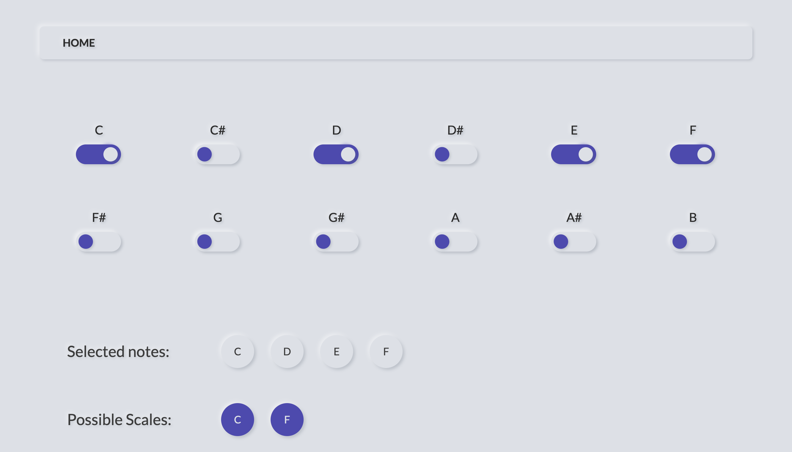
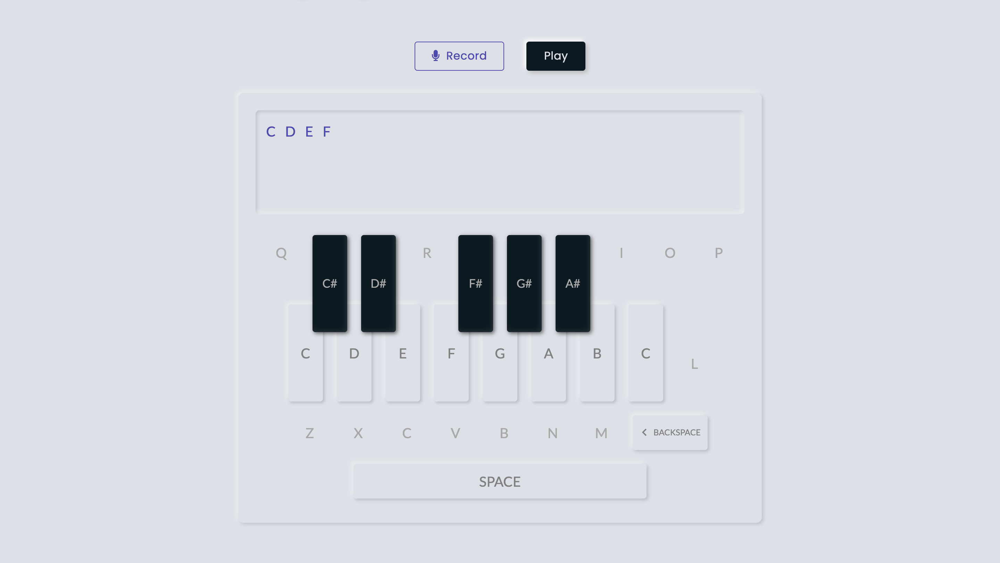
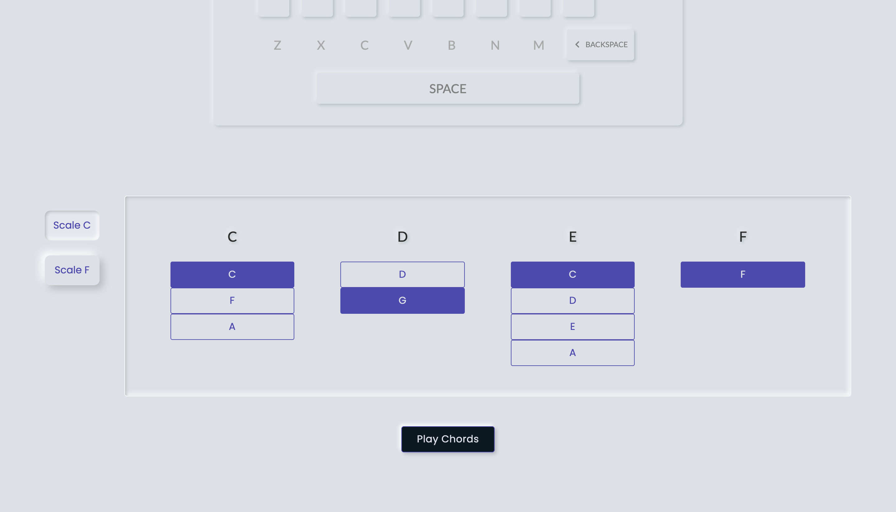

# PolyHarmony

PolyHarmony is a platform created for musicians that helps in deriving chords in possible scales after taking an input of musical notes. In essence, harmony makes this task of figuring out chords for a particular melody easier and less time consuming.

 

<a href="http://ec2-34-210-25-39.us-west-2.compute.amazonaws.com/">Visit website</a>

<a href="https://youtu.be/PzxeoUs9KFI">YouTube</a>

 

 

<b>CI/CD : Cloud Computing for a Django application</b>
 

<a href="https://docs.google.com/document/d/1Cqu7nMxuE_RuETShx_KW_GsbH01QEw-pzaD16H3HOXM/edit?usp=sharing" target="_blank">AWS EC2 & RDS with Django</a>

<a href="https://docs.google.com/document/d/1R7NKhb35kUQYki2Lt3hKeZJOk2iokyuaMeQc40DxjX4/edit?usp=sharing" target="_blank">Using Docker</a>

<a href="https://docs.google.com/document/d/15ZSB8sSqcq_91WpJl4gglsqBBtE8FfXydGRmU7tJIIU/edit?usp=sharing" target="_blank">Kubernetes basics</a>
